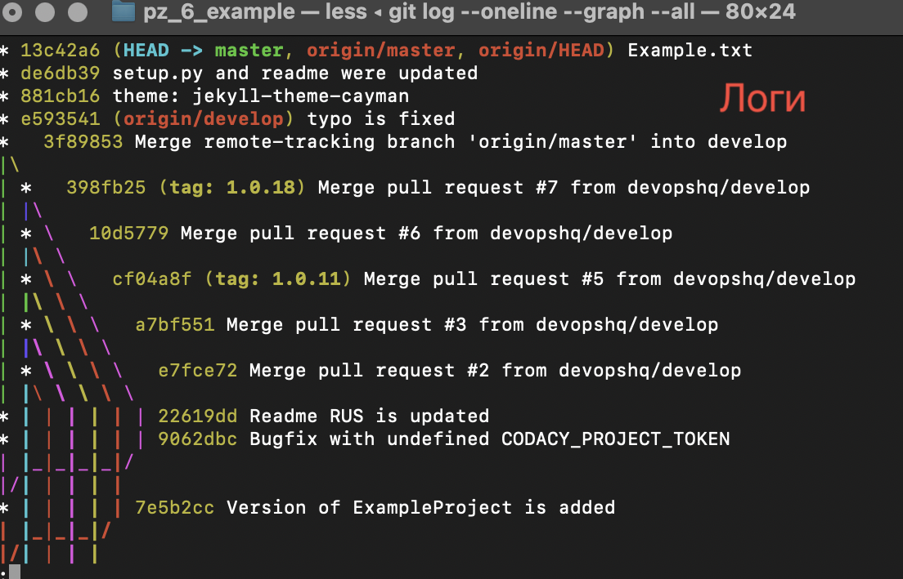
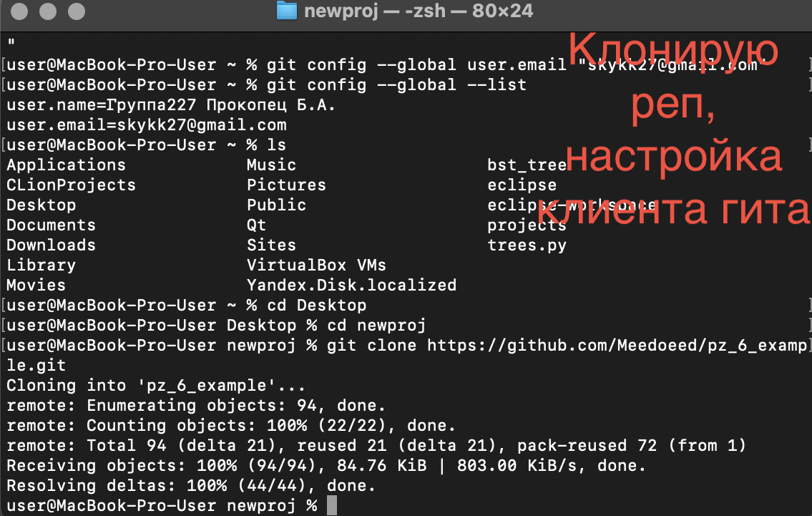
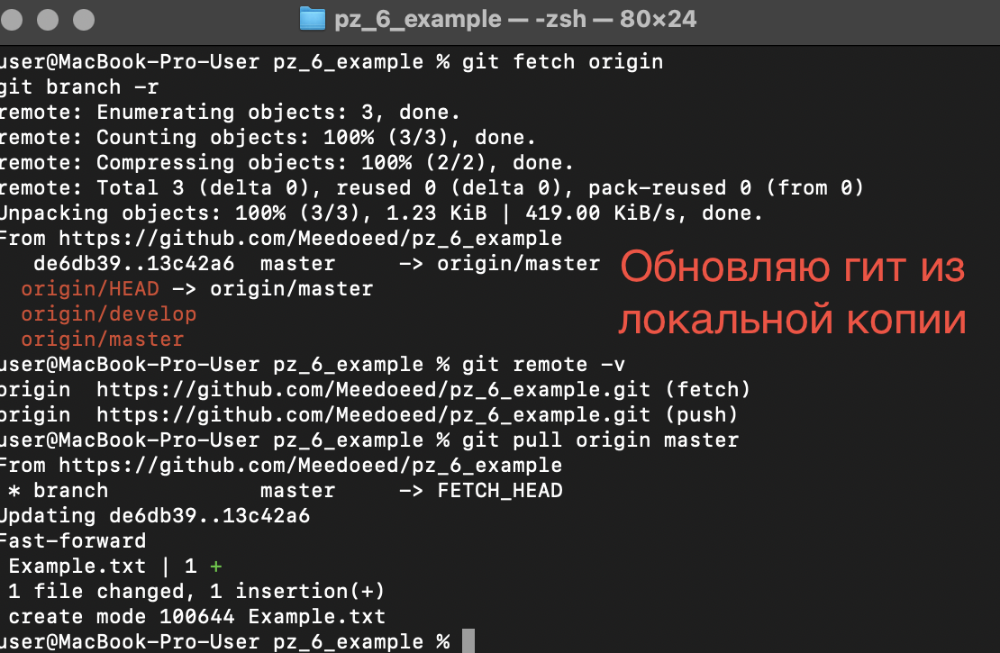
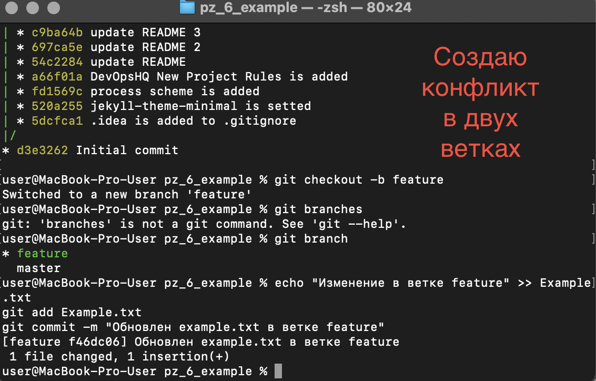
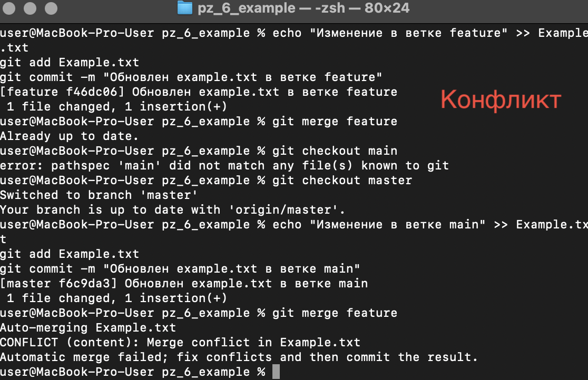
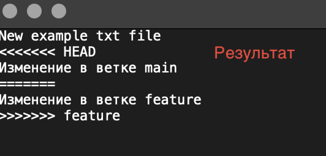
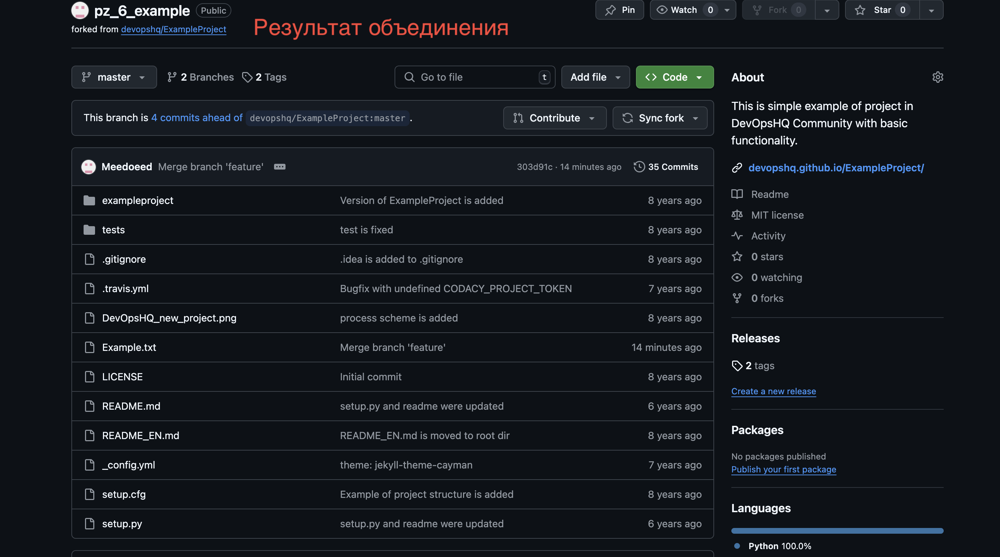
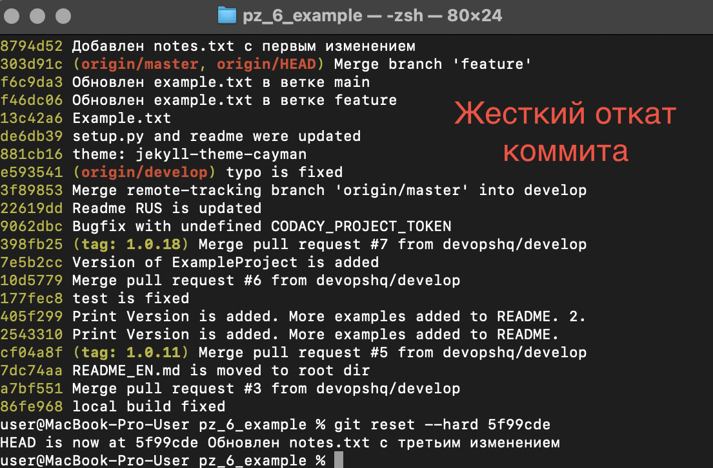

# Отчет по проекту: Работа с Git

## Обзор
Этот отчет документирует процесс работы с Git, выполненный в рамках задания, включая форк, клонирование, создание веток, слияние и загрузку на Gitea.

## Скриншоты
- История коммитов: 
- Клонирование: 
- Обновление из локальной копии: 
- Создание конфликта: 
- Конфликт: 
- Результат конфликта: 
- Результат объединения: 
- Жесткий откат: 


## Лог команд
```bash
git config --global user.name "Группа227 Прокопец Б.А."
git config --global user.email "skykk27@hmail.com"
git clone https://github.com/Meedoeed/pz_6_example.git
cd pz_6_example
git pull origin master
git branch -a
git log --oneline --graph --all
git log -p -n 2
git checkout -b feature
echo "Изменение в ветке feature" >> Example.txt
git add Example.txt
git commit -m "Обновлен example.txt в ветке feature"
git checkout main
echo "Изменение в ветке main" >> Example.txt
git add Example.txt
git commit -m "Обновлен example.txt в ветке main"
git merge feature
git add Example.txt
git commit
git branch -d feature
echo "Первое изменение" >> notes.txt
git add notes.txt
git commit -m "Добавлен notes.txt с первым изменением"
echo "Второе изменение" >> notes.txt
git add notes.txt
git commit -m "Обновлен notes.txt со вторым изменением"
echo "Третье изменение" >> notes.txt
git add notes.txt
git commit -m "Обновлен notes.txt с третьим изменением"
git reset --hard abc123
git checkout -b report
mkdir screenshots